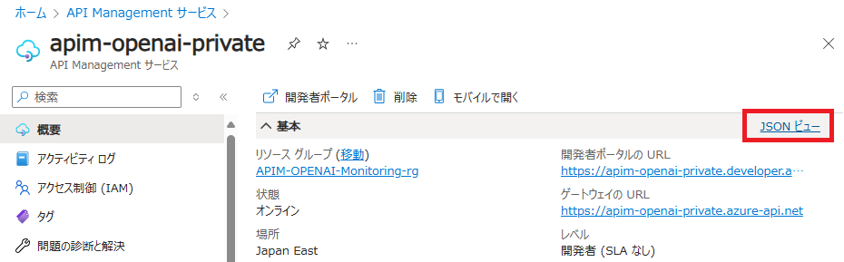
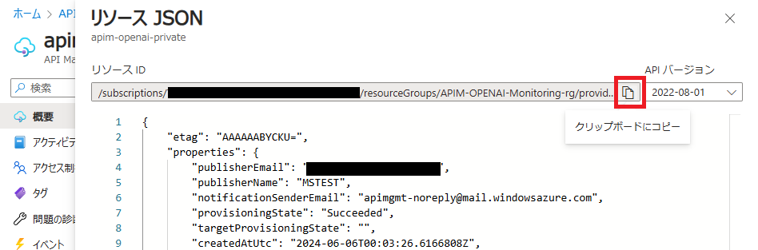
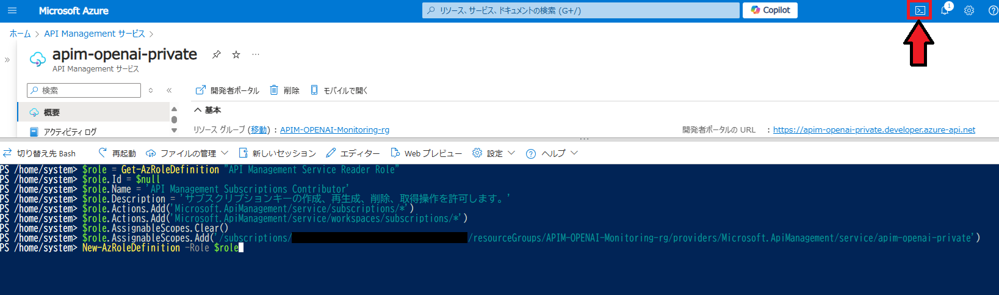
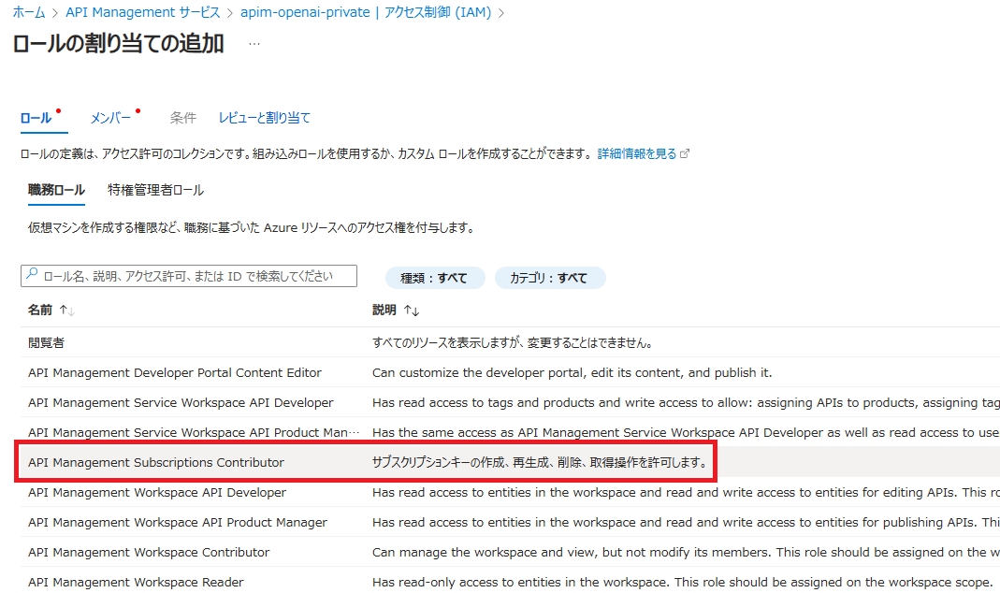
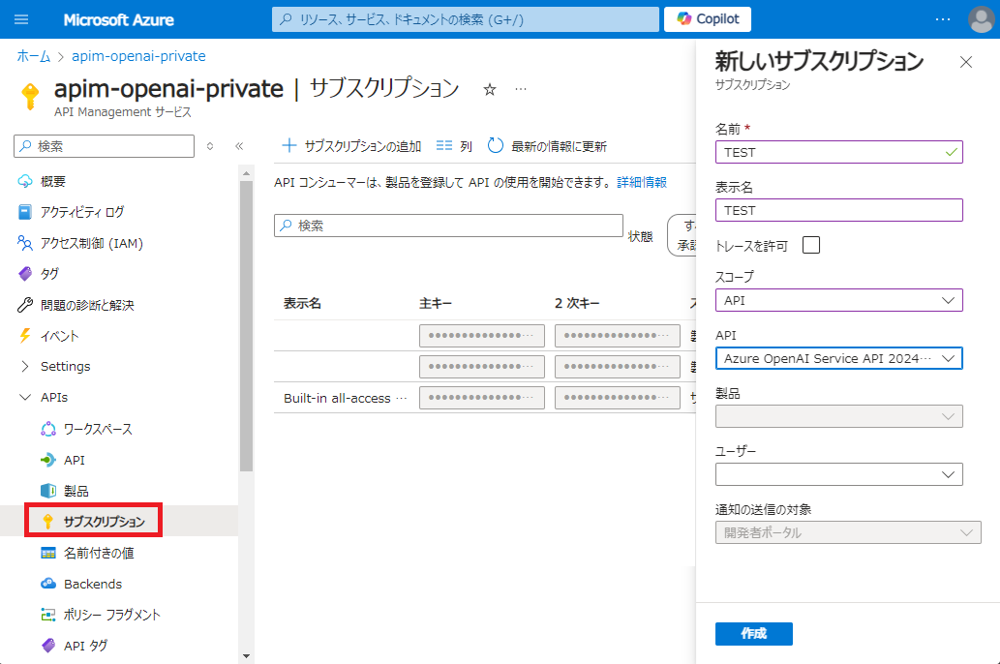

# Azure API Manageent カスタムロールの作成

## 概要
特定のニーズを満たす組み込みロールがない場合は、[カスタム ロール](https://learn.microsoft.com/ja-jp/azure/api-management/api-management-role-based-access-control#custom-roles) を作成して、API Management エンティティのアクセス管理をより詳細にすることができます。 

[API Management で許可できる権限の一覧](https://learn.microsoft.com/ja-jp/azure/role-based-access-control/permissions/integration#microsoftapimanagement)


## カスタムロールの作成
ここでは API Manageent のサブスクリプションキーの作成、再生成、削除、取得操作のみを許可するカスタムロールを作成します。

1. 以下の PowerShell スクリプトを使用します。

```powershell
$role = Get-AzRoleDefinition "API Management Service Reader Role"
$role.Id = $null
$role.Name = 'API Management Subscriptions Contributor'
$role.Description = 'サブスクリプションキーの作成、再生成、削除、取得操作を許可します。'
$role.Actions.Add('Microsoft.ApiManagement/service/subscriptions/*')
$role.Actions.Add('Microsoft.ApiManagement/service/workspaces/subscriptions/*')
$role.AssignableScopes.Clear()
$role.AssignableScopes.Add('/subscriptions/<Azure subscription ID>/resourceGroups/<resource group name>/providers/Microsoft.ApiManagement/service/<APIM service instance name>')
New-AzRoleDefinition -Role $role
```
2. Azure Portal で API Management の **JSON ビュー** をクリックし、**リソース ID** をコピーします。

|  |
| ----- |

|  |
| ----- |

3. スクリプトの以下の個所を、コピーした **リソース ID** に置き換えます。

```powershell
$role.AssignableScopes.Add('/subscriptions/<Azure subscription ID>/resourceGroups/<resource group name>/providers/Microsoft.ApiManagement/service/<APIM service instance name>')
```

4. Azure CloudShell で PowerShell スクリプトを実行します。コピペして最後に Enter キーを叩けば一気に実行できます。

|  |
| ----- |

5. API Management の **アクセス制御 (IAM)** で、作成したカスタムロールを任意のユーザーに割り当てます。

|  |
| ----- |

## 動作検証

カスタムロールを割り当てたユーザーで Azure Portal にログインします。以下の API Management の [サブスクリプション] メニュー部分の操作のみが可能となっている事を確認します。

|  |
| ----- |